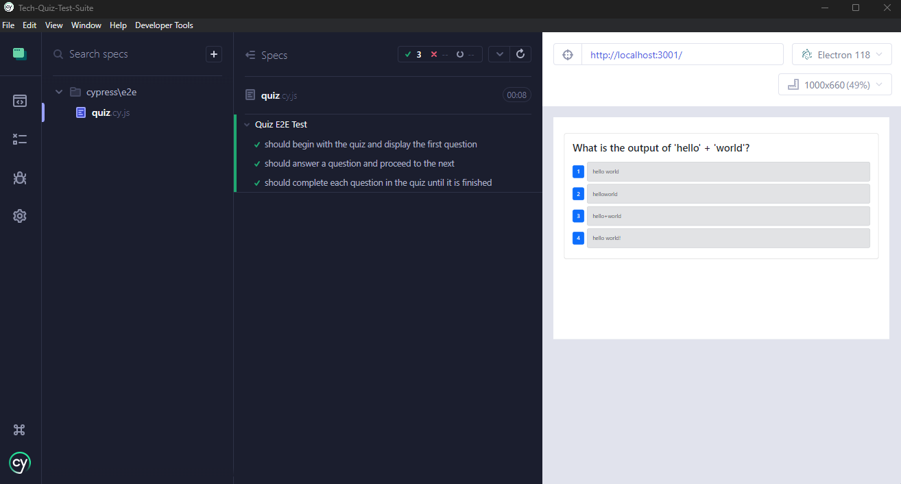

# Tech Quiz Test Suite


## Description
This project implements end-to-end (E2E) testing using Cypress for a quiz-based website. The application allows users to take a quiz, answering questions to receive a score at the end. Cypress testing is incorporated to ensure the app functions correctly, helping detect and debug any issues.

## Table of Contents
- [Installation](#installation)
- [Usage](#usage)
- [License](#license)
- [Features](#features)
- [Tests](#tests)
- [Screenshots](#screenshots)
- [Questions](#questions)

## Installation
To install the necessary dependencies, run the following command:
```bash
npm install
```

## Usage
To run the Cypress tests, you can use either of the following commands:

```bash
npm run test        # Runs tests in headless mode
npm run cypress     # Opens the Cypress interactive test runner
```

## License
This project is licensed under the MIT License.

## Features
- Comprehensive E2E testing using Cypress
- Automated testing suite with `npm run test` and `npm run cypress` commands

## Tests
For an example of the test execution, please refer to the video demonstration:
[Watch the video demonstration](https://app.screencastify.com/v3/watch/yWCqkjg3mYnkY27HUpR8)

## Screenshots


## Questions?
For any questions, feel free to reach out:

- **GitHub**: [durfey32](https://github.com/durfey32)
- **Email**: [durfey_32@yahoo.com](mailto:durfey_32@yahoo.com)
